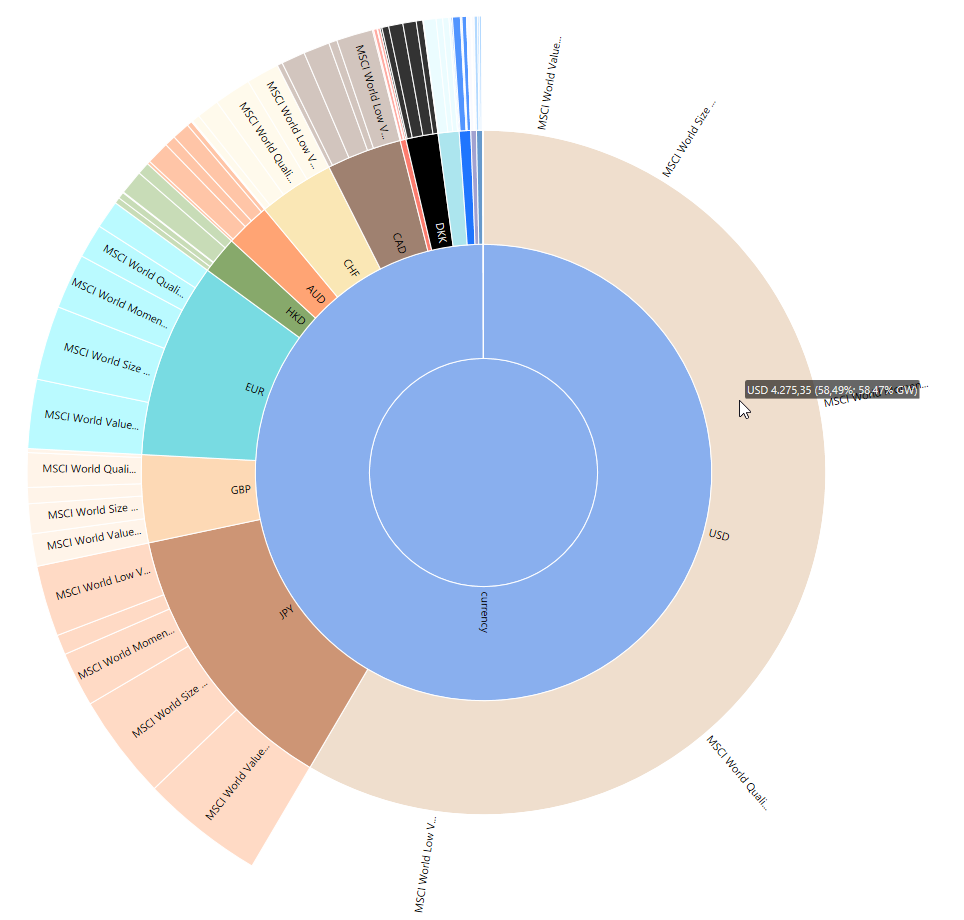
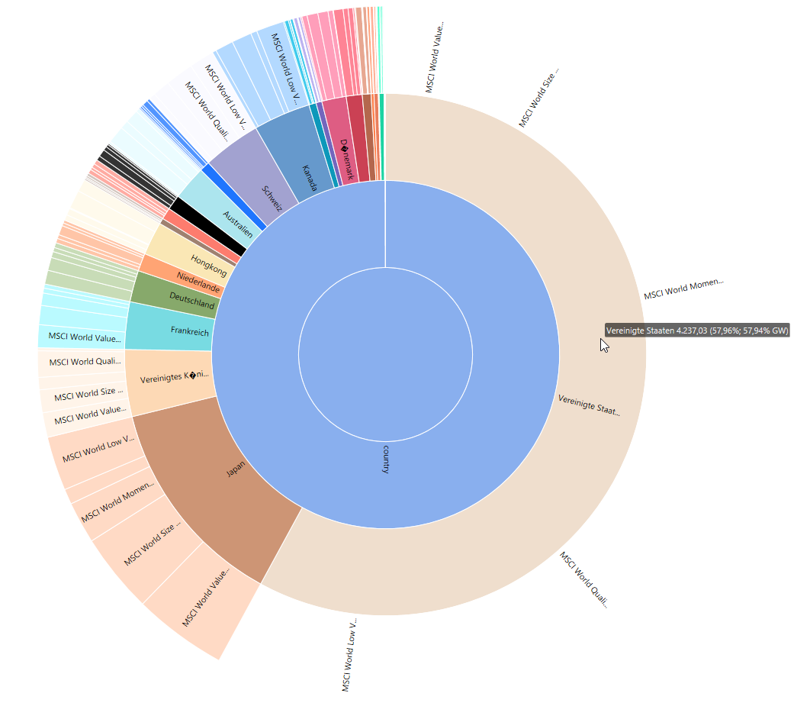
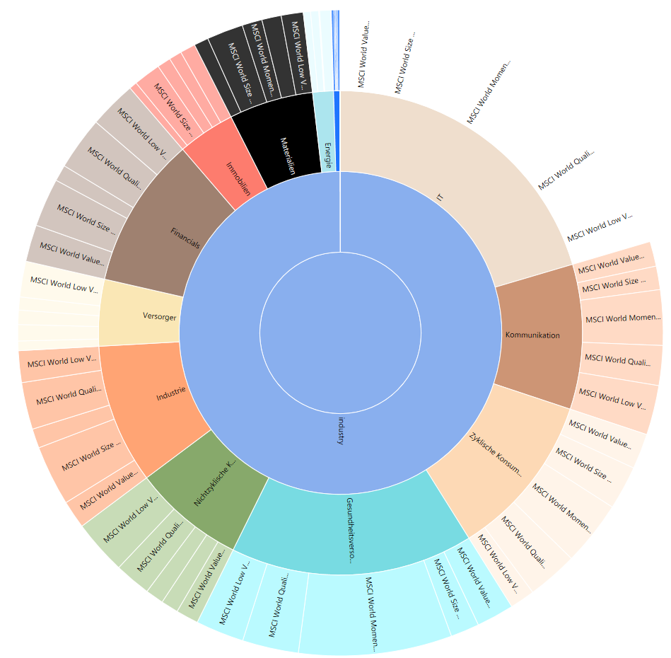

# pp-etf-classifier

I wrote a small python script that automatically classifies ETFs managed in [Portfolio Performance](https://www.portfolio-performance.info/) files by the currencies, countries and industry sectors they are invested in. Furthermore it determines the Top 10 holdings across all PDFs. The classifier uses the list of etf assets as provided by the ETF issuer (iShares etc) as a data source for classification.

## Warnings & Known Issues
- Only works with iShares ETFs at the moment 
- Experimental software - use with caution!  

## Installation
requires Python 3, git and Portfolio Performance.
Steps:
1. `git clone` this repository
2. in the install directory run `pip3 -r requirements.txt`
3. test the script by running `python etf-classifier.py test/multifaktortest.xml > classified.xml` to test the script. Then open `classified.xml` in Portfolio Performance.

## How it works:

**Important: Never try this script on your original Portfolio Performance files -> risk of data loss. Always make a copy first that is safe to play around with or create a dummy portfolio like in test folder.**

1. In Portfolio Performance, save a copy of your portfolio file as unencrypted xml. The script won't work with any other format.
1. Then open the saved copy in PP. Edit each iShares ETF security (Ctrl + E) and add a "Provider" (Anbieter) attribute on the attributes tab. The value of the attribute is the URL of the holdings list that can be obtained from the iShares website, e.g. https://www.ishares.com/de/privatanleger/de/produkte/270051/ishares-msci-world-momentum-factor-ucits-etf -> Link to "Fondspositionen und Kennzahlen")
3. Run the script `python etf-classifier.py <path to pp.xml> > classified.pp.xml` 
4. open classified.pp.xml in Portfolio Performance and check out the additional classifications.

## TODO
- add support for other ETF issuers (xtrackers, ...)
- write tests
- nudge people to make this a PP core feature one day

## Gallery

### Autoclassified Currencies
{:width="600px"}

### Autoclassified Regions
{:width="600px"}

### Autoclassified Sectors
{:width="600px"}